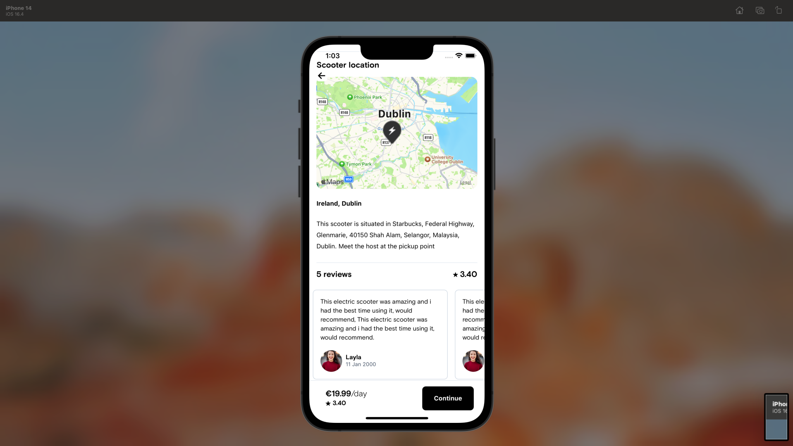
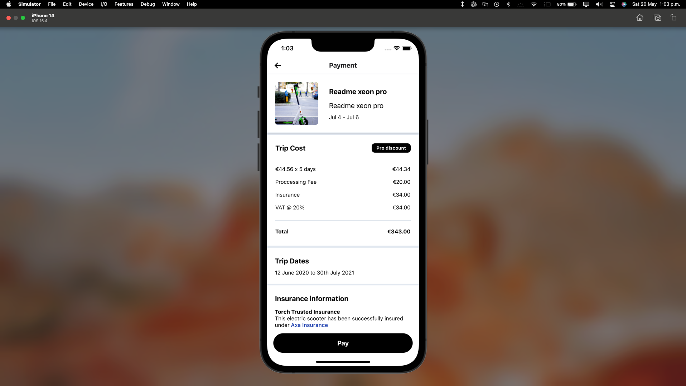
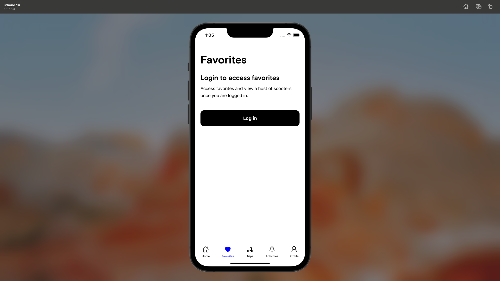

# TorchMobileApp

## Description

The Scooter Rental App is a mobile application built with React, Redux Toolkit, Tailwind CSS, Stripe Payments, and React Native Maps. It allows users to rent electric scooters and make payments securely through Stripe. The app provides a user-friendly interface and integrates with the map functionality to locate available scooters near the user's location.

This readme provides an overview of the app's features and includes placeholders for app screenshots and a GIF demo.

## Features

- User authentication and registration
- Browse and search available scooters
- View scooter details, including location on the map
- Book scooters and make payments through Stripe
- Track active rentals and trip history
- Integration with React Native Maps for displaying scooter locations

## Screenshots

<!-- Replace the placeholders with actual screenshots of your app -->

## App Demo

